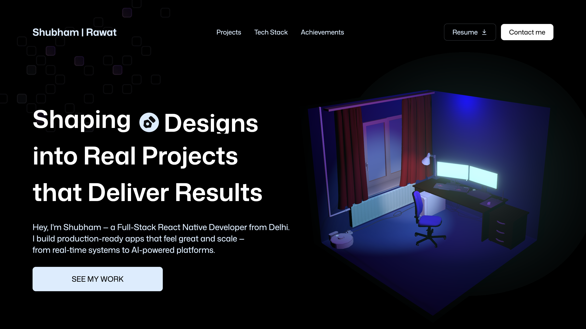

<div align="center">

# 👋 Hi, I'm Shubham Rawat

### Full-Stack Mobile App Developer | React Native

A modern, responsive, and interactive portfolio showcasing my journey in building **production-ready applications**. Built with performance, scalability, and clean design in mind — this portfolio highlights my projects, technical skills, achievements, and passion for software engineering.

[](https://shubhmrwt01.vercel.app/)
[](https://github.com/shubhmrwt01)
[](https://linkedin.com/in/shubhmrwt01)

</div>

---



## 🌐 Live Demo

🔗 **Portfolio:** [Portfolio](https://shubhmrwt01.vercel.app/)

---

## ✨ Features

|                                   |                                              |
| --------------------------------- | -------------------------------------------- |
| 🎨 Modern & responsive UI         | ⚡ Smooth GSAP-powered animations            |
| 📱 Mobile-first design            | 💼 Detailed featured projects                |
| 🛠️ Interactive tech stack section | 🏆 Achievements & coding stats               |
| 📄 One-click resume download      | 📬 Direct contact section                    |
| 🌙 Clean dark-themed interface    | 🚀 Optimized for performance & accessibility |

---

## 🛠️ Tech Stack

<div align="center">


</div>

### Why these tools?

- **React + Vite** — fast dev experience and optimized production builds
- **Tailwind CSS** — utility-first styling for rapid, consistent UI development
- **GSAP** — fine-grained control over scroll-based and timeline animations
- **Three.js / React Three Fiber / Drei** — interactive 3D elements rendered declaratively in React
- **Git & GitHub** — version control and collaboration
- **Vercel / Netlify** — zero-config deployment with CI built in

---

## 📂 Project Structure

```text
portfolio/
├── public/
│   ├── images/
│   └── models/
│
├── src/
│   ├── components/
│   ├── sections/
│   ├── constants/
│   ├── assets/
│   ├── styles/
│   ├── hooks/
│   └── App.jsx
│
├── package.json
└── README.md
```

---

## 🚀 Getting Started

### 1. Clone the repository

```bash
git clone https://github.com/your-username/portfolio.git
```

### 2. Navigate into the project

```bash
cd portfolio
```

### 3. Install dependencies

```bash
npm install
```

### 4. Start the development server

```bash
npm run dev
```

Open your browser and visit:

```text
http://localhost:5173
```

### 5. Build for production

```bash
npm run build
```

---

## ☁️ Deployment

This project is optimized for one-click deployment on **Vercel** or **Netlify**:

```bash
# Vercel
npm i -g vercel
vercel

# Netlify
npm i -g netlify-cli
netlify deploy
```

---

## 📌 Portfolio Sections

- 🏠 Hero
- 👨‍💻 About
- 🚀 Projects
- 💻 Tech Stack
- 🏆 Achievements
- 📄 Resume
- 📬 Contact
- 🔗 Footer

---

## 📊 Highlights

- ✅ 600+ DSA Problems Solved
- 🏅 LeetCode Rating: **1626+**
- 🥈 2nd Rank — EROH-2025
- 🌍 Hacktoberfest Level 4 Contributor
- 📱 Built 3+ Production-Ready Mobile Applications

---

## 📬 Contact

Have a project in mind or just want to connect?

- 📧 **Email:** shubhmrwt01@gmail.com
- 💼 **LinkedIn:** [linkedin.com/in/shubhmrwt01](https://linkedin.com/in/shubhmrwt01)
- 🐙 **GitHub:** [github.com/shubhmrwt01](https://github.com/shubhmrwt01)

---

## 📄 License

This project is licensed under the **MIT License** — see the [LICENSE](LICENSE) file for details.

---

<div align="center">

**Shubham Rawat**

[](https://github.com/shubhmrwt01)
[](https://linkedin.com/in/shubhmrwt01)

### ⭐ Star this repo if you find it helpful!

Made with ❤️ by Shubham Rawat

_© 2026 Shubham Rawat. All rights reserved._

</div>
